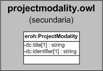

| Fecha         | 15/03/2022                                                   |
| ------------- | ------------------------------------------------------------ |
|Título|Objeto de Conocimiento ProjectModality| 
|Descripción|Descripción del objeto de conocimiento ProjectModality para Hércules|
|Versión|1.0|
|Módulo|Documentación|
|Tipo|Especificación|
|Cambios de la Versión|Versión inicial|

# Hércules ED. Objeto de conocimiento ProjectModality

La entidad eroh:ProjectModality (ver Figura 1) representa el tipo de modalidad del proyecto en el Curriculum Vitae en la plataforma Hércules. Dispone de varias opciones:
- De demostración, proyectos piloto, de formulación conceptual y diseño de productos y de procesos o servicios
- De investigación fundamental (incluyendo excavaciones arqueológicas, etc.)
- De investigación industrial
- De investigación y desarrollo incluida traslacional
- Estudio de viabilidad técnica
- De actividad de desarrollo precompetitiva

*Figura 1. Diagrama ontológico para la entidad eroh:ProjectModality*
