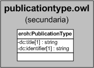

| Fecha         | 15/03/2022                                                   |
| ------------- | ------------------------------------------------------------ |
|Título|Objeto de Conocimiento PublicationType| 
|Descripción|Descripción del objeto de conocimiento PublicationType para Hércules|
|Versión|1.0|
|Módulo|Documentación|
|Tipo|Especificación|
|Cambios de la Versión|Versión inicial|

# Hércules ED. Objeto de conocimiento PublicationType

La entidad eroh:PublicationType (ver Figura 1) representa el tipo de producción en el Curriculum Vitae en la plataforma Hércules. Dispone de varias opciones:
- Capítulo de libro
- Informe científico-técnico
- Artículo científico
- Libro o monografía científica
- Articulos en prensa
- Diccionario común
- Revistas de difusión General
- Artículo de enciclopedia
- Artículo de diculgación
- Traducción
- Reseña
- Revisión bibliográfica
- Libro de divulgación
- Edición científica
- Diccionario científico
- Otros

*Figura 1. Diagrama ontológico para la entidad eroh:PublicationType*
