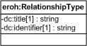

| Fecha         | 15/03/2022                                                   |
| ------------- | ------------------------------------------------------------ |
|Título|Objeto de Conocimiento RelationshipType| 
|Descripción|Descripción del objeto de conocimiento RelationshipType para Hércules|
|Versión|1.0|
|Módulo|Documentación|
|Tipo|Especificación|
|Cambios de la Versión|Versión inicial|

# Hércules ED. Objeto de conocimiento RelationshipType

La entidad eroh:RelationshipType (ver Figura 1) representa el modo de relación en el Curriculum Vitae en la plataforma Hércules. Dispone de varias opciones:
- Publicaciones confirmadas
- Cogestión
- Participacion en convenios de colaboracion de larga duración entre entidades
- Proyectos coordinados
- Redes con proyecto conjunto
- Redes sin proyecto conjunto
- Otros

*Figura 1. Diagrama ontológico para la entidad eroh:RelationshipType*
