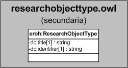

| Fecha         | 15/03/2022                                                   |
| ------------- | ------------------------------------------------------------ |
|Título|Objeto de Conocimiento ResearchObjectType| 
|Descripción|Descripción del objeto de conocimiento ResearchObjectType para Hércules|
|Versión|1.0|
|Módulo|Documentación|
|Tipo|Especificación|
|Cambios de la Versión|Versión inicial|

# Hércules ED. Objeto de conocimiento ResearchObjectType

La entidad eroh:ResearchObjectType (ver Figura 1) representa el tipo de los research objects en el Curriculum Vitae en la plataforma Hércules. Dispone de varias opciones:
- Dataset
- Presentación
- Gráfico
- Documento
- Enlace
- Video
- Poster
- Lección
- Código

*Figura 1. Diagrama ontológico para la entidad eroh:ResearchObjectType*
