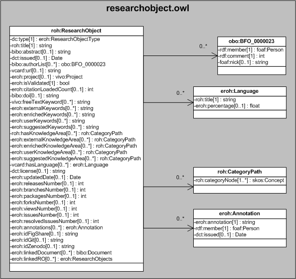

| Fecha         | 15/03/2022                                                   |
| ------------- | ------------------------------------------------------------ |
|Título|Objeto de Conocimiento ResearchObject| 
|Descripción|Descripción del objeto de conocimiento ResearchObject para Hércules|
|Versión|1.0|
|Módulo|Documentación|
|Tipo|Especificación|
|Cambios de la Versión|Versión inicial|

# Hércules ED. Objeto de conocimiento ResearchObject

La entidad eroh:ResearchObject (ver Figura 1) representa un objeto de investigación.

Una instancia de eroh:ResearchObject se asocia, a su vez, con las siguientes entidades a través de propiedades de objeto:

- [eroh:ResearchObjectType](https://github.com/HerculesCRUE/Commons-ED-MA/tree/main/ObjetosDeConocimiento/ResearchObjectType), representa .
- obo:BFO_0000023, representa a los autores.
- [vivo:Project](https://github.com/HerculesCRUE/Commons-ED-MA/tree/main/ObjetosDeConocimiento/Project), representa 
- [eroh:Language](https://github.com/HerculesCRUE/Commons-ED-MA/tree/main/ObjetosDeConocimiento/Language), representa al tipo de lenguaje de programación.
- roh:CategoryPath, representa las áreas temáticas.
- [roh:Annotation](https://github.com/HerculesCRUE/Commons-ED-MA/tree/main/ObjetosDeConocimiento/Annotation), representa a las anotaciones.
- [bibo:Document](https://github.com/HerculesCRUE/Commons-ED-MA/tree/main/ObjetosDeConocimiento/Document), representa
- [eroh:ResearchObject](https://github.com/HerculesCRUE/Commons-ED-MA/tree/main/ObjetosDeConocimiento/Researchobject), representa

*Figura 1. Diagrama ontológico para la entidad eroh:ResearchObject*
