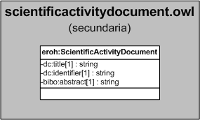

| Fecha         | 15/03/2022                                                   |
| ------------- | ------------------------------------------------------------ |
|Título|Objeto de Conocimiento ScientificActivityDocument| 
|Descripción|Descripción del objeto de conocimiento ScientificActivityDocument para Hércules|
|Versión|1.0|
|Módulo|Documentación|
|Tipo|Especificación|
|Cambios de la Versión|Versión inicial|

# Hércules ED. Objeto de conocimiento ScientificActivityDocument

La entidad eroh:ScientificActivityDocument (ver Figura 1) representa el tipo de los documentos de actividad científica en el Curriculum Vitae en la plataforma Hércules. Dispone de varias opciones:
- Publicaciones
- En congresos
- En jornadas, seminarios...
- De divulgación

*Figura 1. Diagrama ontológico para la entidad eroh:ScientificActivityDocument*
