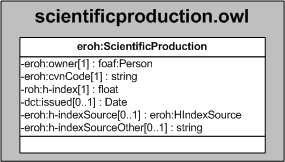

| Fecha         | 15/03/2022                                                   |
| ------------- | ------------------------------------------------------------ |
|Título|Objeto de Conocimiento ScientificProduction| 
|Descripción|Descripción del objeto de conocimiento ScientificProduction para Hércules|
|Versión|1.0|
|Módulo|Documentación|
|Tipo|Especificación|
|Cambios de la Versión|Versión inicial|

# Hércules ED. Objeto de conocimiento ScientificProduction

La entidad eroh:ScientificProduction (ver Figura 1) representa la producción científica.

Las propiedades son las siguientes:

- eroh:owner
- eroh:cvnCode
- roh:h-index
- dct:issued
- eroh:h-indexSource
- eroh:h-indexSourceOther

*Figura 1. Diagrama ontológico para la entidad eroh:ScientificProduction*
