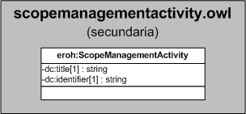

| Fecha         | 15/03/2022                                                   |
| ------------- | ------------------------------------------------------------ |
|Título|Objeto de Conocimiento ScopeManagementActivity| 
|Descripción|Descripción del objeto de conocimiento ScopeManagementActivity para Hércules|
|Versión|1.0|
|Módulo|Documentación|
|Tipo|Especificación|
|Cambios de la Versión|Versión inicial|

# Hércules ED. Objeto de conocimiento ScopeManagementActivity

La entidad eroh:ScopeManagementActivity (ver Figura 1) representa si la actividad comprende actividades de gestión en el Curriculum Vitae en la plataforma Hércules. Dispone de varias opciones:
- Universitaria
- OPIs
- Comunidades Autónomas
- Administración General del Estado
- Otros

*Figura 1. Diagrama ontológico para la entidad eroh:ScopeManagementActivity*
