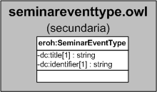

| Fecha         | 15/03/2022                                                   |
| ------------- | ------------------------------------------------------------ |
|Título|Objeto de Conocimiento SeminarEventType| 
|Descripción|Descripción del objeto de conocimiento SeminarEventType para Hércules|
|Versión|1.0|
|Módulo|Documentación|
|Tipo|Especificación|
|Cambios de la Versión|Versión inicial|

# Hércules ED. Objeto de conocimiento SeminarEventType

La entidad eroh:SeminarEventType (ver Figura 1) representa el tipo de evento, de la sección "Trabajos presentados en jornadas, seminarios, talleres de trabajo y/o cursos nacionales o internacionales", en el Curriculum Vitae en la plataforma Hércules. Dispone de varias opciones:
- Curso
- Jornada
- Seminario
- Teller de trabajo
- Otros

*Figura 1. Diagrama ontológico para la entidad eroh:SeminarEventType*
