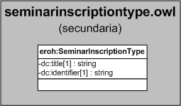

| Fecha         | 15/03/2022                                                   |
| ------------- | ------------------------------------------------------------ |
|Título|Objeto de Conocimiento SeminarInscriptionType| 
|Descripción|Descripción del objeto de conocimiento SeminarInscriptionType para Hércules|
|Versión|1.0|
|Módulo|Documentación|
|Tipo|Especificación|
|Cambios de la Versión|Versión inicial|

# Hércules ED. Objeto de conocimiento SeminarInscriptionType

La entidad eroh:SeminarInscriptionType (ver Figura 1) representa el tipo de intervención, de la sección "Trabajos presentados en jornadas, seminarios, talleres de trabajo y/o cursos nacionales o internacionales", en el Curriculum Vitae en la plataforma Hércules. Dispone de varias opciones:
- Ponente
- Por invitación

A continuación se listan todas aquellas propiedades contenidas en eroh:SeminarInscriptionType que extienden la ontología fundamental ROH con el fin de ajustarse a las necesidades de Hércules EDMA:

- dc:title
- dc:identifier

*Figura 1. Diagrama ontológico para la entidad eroh:SeminarInscriptionType*
