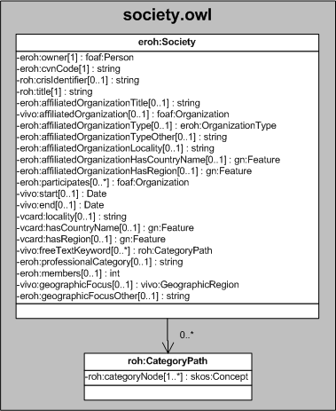

| Fecha         | 10/12/2021                                                   |
| ------------- | ------------------------------------------------------------ |
|Título|Objeto de Conocimiento Sociedad| 
|Descripción|Descripción del objeto de conocimiento Sociedad para Hércules|
|Versión|1.0|
|Módulo|Documentación|
|Tipo|Especificación|
|Cambios de la Versión|Versión inicial|

# Hércules ED. Objeto de conocimiento Sociedad

La entidad eroh:Society (ver Figura 1) representa  sociedades científicas, literarias o artísticas establecidas con autoridad pública, así como las sociedades y asociaciones nacionales e internacionales de carácter científico-técnico, tecnológico, académico y/o profesional (colegios profesionales, reales sociedades, patronatos de museos, fundaciones culturales, etc.).
Se han añadido varias propiedades que extienden la ontología fundamental con el fin de dar respuesta a las necesidades de gestión de datos requeridas durante el desarrollo de la infraestructura.

Las propiedades extendidas son las siguientes:

- eroh:participates
- eroh:professionalCategory
- eroh:members
- eroh:geographicFocusOther

Una instancia de eroh:Society se asocia, a su vez, con las siguientes entidades a través de propiedades de objeto:

- foaf:Organization, que referencia la organización a la que la sociedad está afiliada (vivo:affiliatedOrganization), además de aquellas organizaciones participantes de dicha sociedad (eroh:participates).
- gn:Feature, que relaciona la sociedad o asociación con el país (vcard:hasCountryName) y la región (vcard:hasRegion) de radicación.
- roh:CategoryPath, que representa mediante un esquema jerárquico el tesauro con las áreas temáticas descriptoras de la sociedad.
- vivo:GeographicRegion, representa el ámbito geográfico de la sociedad.

*Figura 1. Diagrama ontológico para la entidad eroh:Society*
