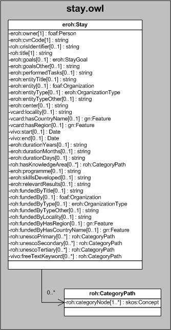

| Fecha         | 09/12/2021                                                   |
| ------------- | ------------------------------------------------------------ |
|Título|Objeto de Conocimiento Estancia| 
|Descripción|Descripción del objeto de conocimiento Estancia para Hércules|
|Versión|1.0|
|Módulo|Documentación|
|Tipo|Especificación|
|Cambios de la Versión|Versión inicial|

# Hércules ED. Objeto de conocimiento Estancia

La entidad eroh:Stay (ver Figura 1) representa estancias de movilidad temporal del titular del CV en centros I+D+i de enseñanza superior y/o de investigación de titularidad pública o privada, nacionales e internacionales.
Se han añadido ciertas propiedades que extienden la ontología fundamental con el fin de dar respuesta a las necesidades de gestión de datos requeridas durante el desarrollo de la infraestructura Hércules EDMA.

Las propiedades extendidas son las siguientes:

- eroh:goals
- eroh:goalsOther
- eroh:performedTasks
- eroh:entity
- eroh:durationYears
- eroh:durationMonths
- eroh:durationDays
- eroh:programme
- eroh:skillsDeveloped
- eroh:relevantResults

Una instancia de eroh:Stay se asocia con las siguientes entidades a través de propiedades de objeto:

- eroh:StayGoal, que se emplea para representar los objetivos de la estancia.
- foaf:Organization, que relaciona la estancia con la entidad donde se ha realizado (eroh:entity), así como la entidad responsable de su financiación (roh:fundedBy).
- roh:CategoryPath, que representa el ámbito geográfico en el que se desarrolla la estancia.

*Figura 1. Diagrama ontológico para la entidad eroh:Stay*
