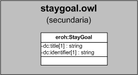

| Fecha         | 15/03/2022                                                   |
| ------------- | ------------------------------------------------------------ |
|Título|Objeto de Conocimiento StayGoal| 
|Descripción|Descripción del objeto de conocimiento StayGoal para Hércules|
|Versión|1.0|
|Módulo|Documentación|
|Tipo|Especificación|
|Cambios de la Versión|Versión inicial|

# Hércules ED. Objeto de conocimiento StayGoal

La entidad eroh:StayGoal (ver Figura 1) representa el tipo de objetivo de la estancia en el Curriculum Vitae en la plataforma Hércules. Dispone de varias opciones:
- Contratado/a
- Doctorado/a
- Invitado/a
- Posdoctoral
- Otros

*Figura 1. Diagrama ontológico para la entidad eroh:StayGoal*
