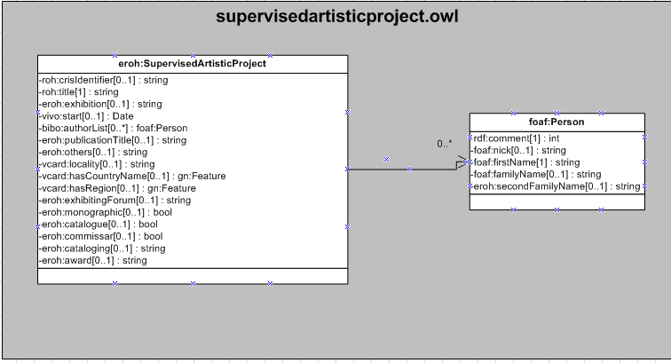

| Fecha         | 09/12/2021                                                   |
| ------------- | ------------------------------------------------------------ |
|Título|Objeto de Conocimiento Obra Artística Dirigida| 
|Descripción|Descripción del objeto de conocimiento Obra Artística Dirigida para Hércules|
|Versión|1.0|
|Módulo|Documentación|
|Tipo|Especificación|
|Cambios de la Versión|Versión inicial|

# Hércules ED. Objeto de conocimiento Obra Artística Dirigida

La entidad eroh:SupervisedArtisticProject (ver Figura 1) representa obras artísticas realizadas por encargo, presentadas en exposiciones individuales o colectivas y ferias organizadas por instituciones públicas y privadas, obras pertenecientes a museos o colecciones públicas o privadas, fotografías científicas y técnicas admitidas a concursos, participación del investigador en exposiciones de prestigio (como autor o como comisario de las mismas).
Se han añadido ciertas propiedades que extienden la ontología fundamental con el fin de dar respuesta a las necesidades de gestión de datos requeridas durante el desarrollo de la infraestructura Hércules EDMA.

Las propiedades extendidas son las siguientes:

- eroh:others
- eroh:exhibitingForum
- eroh:monographic
- eroh:catalogue
- eroh:cataloguing
- eroh:award
- eroh:publicationTitle
- eroh:collective

Una instancia de eroh:SupervisedArtisticProject se asocia con las siguientes entidades a través de propiedades de objeto:

- obo:BFO_0000023, que vincula la obra artística con su autor o autores.
- gn:Feature, que relaciona la exposición con el país (vcard:hasCountryName) y la región (vcard:hasRegion) donde tiene lugar.

*Figura 1. Diagrama ontológico para la entidad eroh:SupervisedArtisticProject*
