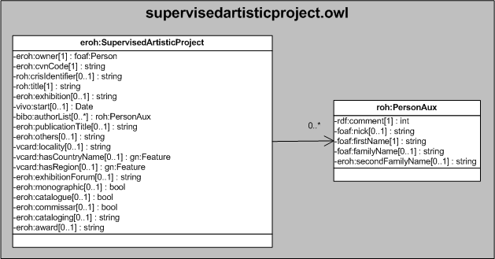

| Fecha         | 09/12/2021                                                   |
| ------------- | ------------------------------------------------------------ |
|Título|Objeto de Conocimiento SupervisedArtisticProject| 
|Descripción|Descripción del objeto de conocimiento SupervisedArtisticProject para Hércules|
|Versión|1.0|
|Módulo|Documentación|
|Tipo|Especificación|
|Cambios de la Versión|Versión inicial|

# Hércules ED. Objeto de conocimiento SupervisedArtisticProject

La entidad eroh:SupervisedArtisticProject (ver Figura 1) representa obras artísticas realizadas por encargo, presentadas en exposiciones individuales o colectivas y ferias organizadas por instituciones públicas y privadas, obras pertenecientes a museos o colecciones públicas o privadas, fotografías científicas y técnicas admitidas a concursos, participación del investigador en exposiciones de prestigio (como autor o como comisario de las mismas).
Se han añadido ciertas propiedades que extienden la ontología fundamental con el fin de dar respuesta a las necesidades de gestión de datos requeridas durante el desarrollo de la infraestructura Hércules EDMA.

Una instancia de eroh:SupervisedArtisticProject se asocia con las siguientes entidades a través de propiedades de objeto:

- [foaf:Person](https://github.com/HerculesCRUE/Commons-ED-MA/tree/main/ObjetosDeConocimiento/Person), representa la persona asociada a la obra.
- roh:PersonAux, representa los autores de la obra.
- [gn:Feature](https://github.com/HerculesCRUE/Commons-ED-MA/tree/main/ObjetosDeConocimiento/Feature), representa el país y la comunidad autónoma o región de celebración.

Una instancia de eroh:SupervisedArtisticProject se asocia con las siguientes entidades a través de propiedades de objeto:

*Figura 1. Diagrama ontológico para la entidad eroh:SupervisedArtisticProject*
