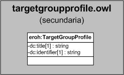

| Fecha         | 15/03/2022                                                   |
| ------------- | ------------------------------------------------------------ |
|Título|Objeto de Conocimiento TargetGroupProfile| 
|Descripción|Descripción del objeto de conocimiento TargetGroupProfile para Hércules|
|Versión|1.0|
|Módulo|Documentación|
|Tipo|Especificación|
|Cambios de la Versión|Versión inicial|

# Hércules ED. Objeto de conocimiento TargetGroupProfile

La entidad eroh:TargetGroupProfile (ver Figura 1) representa el tipo de perfil del grupo receptor en el Curriculum Vitae en la plataforma Hércules. Dispone de varias opciones:
- Agencias financiadoras de I+D+i públicas
- Agencias financiadoras de I+D+i privadas sin ánimo de lucro
- Agencias de selección de personal investigador o técnico o gestor de I+D+i
- Agencias de opinión oficial
- Agencias de opinión pública
- Agencias de evaluación del sistema de I+D+i

*Figura 1. Diagrama ontológico para la entidad eroh:TargetGroupProfile*
