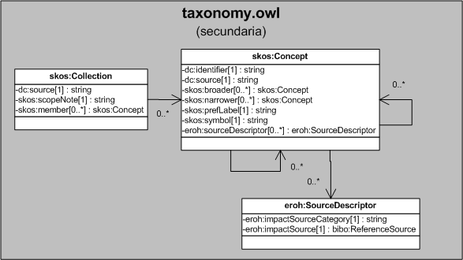

| Fecha         | 15/03/2022                                                   |
| ------------- | ------------------------------------------------------------ |
|Título|Objeto de Conocimiento Taxonomy| 
|Descripción|Descripción del objeto de conocimiento Taxonomy para Hércules|
|Versión|1.0|
|Módulo|Documentación|
|Tipo|Especificación|
|Cambios de la Versión|Versión inicial|

# Hércules ED. Objeto de conocimiento Taxonomy

*Figura 1. Diagrama ontológico para la entidad eroh:Taxonomy*
