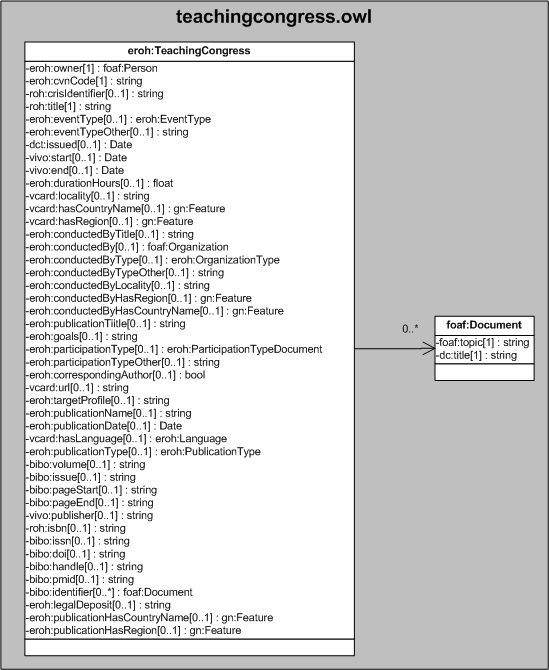

| Fecha         | 15/03/2022                                                   |
| ------------- | ------------------------------------------------------------ |
|Título|Objeto de Conocimiento TeachingCongress| 
|Descripción|Descripción del objeto de conocimiento TeachingCongress para Hércules|
|Versión|1.0|
|Módulo|Documentación|
|Tipo|Especificación|
|Cambios de la Versión|Versión inicial|

# Hércules ED. Objeto de conocimiento TeachingCongress

La entidad eroh:TeachingCongress (ver Figura 1) representa una Participación en congresos con ponencias orientadas a la formación docente en el Curriculum Vitae en la plataforma Hércules.

Una instancia de eroh:TeachingCongress se asocia con las siguientes entidades a través de propiedades de objeto:

- [foaf:Person](https://github.com/HerculesCRUE/Commons-ED-MA/tree/main/ObjetosDeConocimiento/Person), representa la persona asociada la participación en congresos.
- [eroh:EventType](https://github.com/HerculesCRUE/Commons-ED-MA/tree/main/ObjetosDeConocimiento/EventType), representa el tipo de evento en el que se ha presentado la ponencia.
- [gn:Feature](https://github.com/HerculesCRUE/Commons-ED-MA/tree/main/ObjetosDeConocimiento/Feature), representa el país y comunidad autónoma o región de celebración, de la entidad organizadora y de la publicación.
- [foaf:Organization](https://github.com/HerculesCRUE/Commons-ED-MA/tree/main/ObjetosDeConocimiento/Organization), representa la entidad organizadora.
- [eroh:OrganizationType](https://github.com/HerculesCRUE/Commons-ED-MA/tree/main/ObjetosDeConocimiento/OrganizationType), representa el tipo de entidad organizadora.
- [eroh:ParticipationTypeDocument](https://github.com/HerculesCRUE/Commons-ED-MA/tree/main/ObjetosDeConocimiento/ParticipationTypeDocument), representa el tipo de participación.
- [eroh:Language](https://github.com/HerculesCRUE/Commons-ED-MA/tree/main/ObjetosDeConocimiento/Language), representa el idioma de la presentación.
- [eroh:PublicationType](https://github.com/HerculesCRUE/Commons-ED-MA/tree/main/ObjetosDeConocimiento/PublicationType), representa el tipo de material publicado.
- foaf:Document, representa otros identificadores.

*Figura 1. Diagrama ontológico para la entidad eroh:TeachingCongress*
