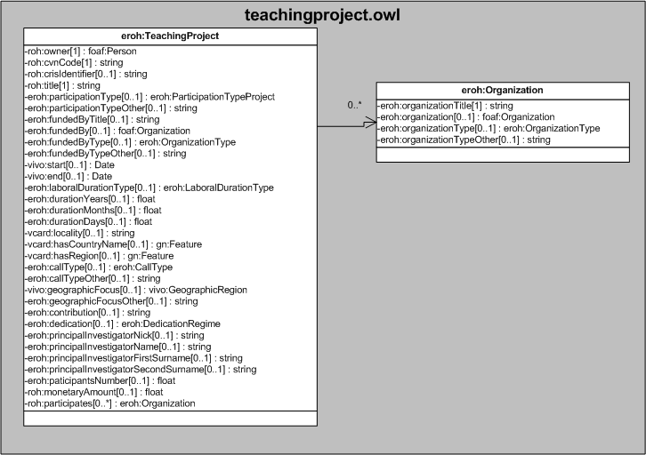

| Fecha         | 15/03/2022                                                   |
| ------------- | ------------------------------------------------------------ |
|Título|Objeto de Conocimiento TeachingProject| 
|Descripción|Descripción del objeto de conocimiento TeachingProject para Hércules|
|Versión|1.0|
|Módulo|Documentación|
|Tipo|Especificación|
|Cambios de la Versión|Versión inicial|

# Hércules ED. Objeto de conocimiento TeachingProject

La entidad eroh:TeachingProject (ver Figura 1) representa una Participación en proyectos de innovación docente en el Curriculum Vitae en la plataforma Hércules.

Una instancia de eroh:TeachingProject se asocia con las siguientes entidades a través de propiedades de objeto:

- [foaf:Person](https://github.com/HerculesCRUE/Commons-ED-MA/tree/main/ObjetosDeConocimiento/Person), representa la persona asociada la publicación.
- [eroh:ParticipationTypeProject](https://github.com/HerculesCRUE/Commons-ED-MA/tree/main/ObjetosDeConocimiento/ParticipationTypeProject), representa la modalidad de participación del proyecto.
- [foaf:Organization](https://github.com/HerculesCRUE/Commons-ED-MA/tree/main/ObjetosDeConocimiento/Organization), representa la entidad financiadora.
- [eroh:OrganizationType](https://github.com/HerculesCRUE/Commons-ED-MA/tree/main/ObjetosDeConocimiento/OrganizationType), representa el carácter de la entidad que ha financiado.
- [eroh:LaboralDurationType](https://github.com/HerculesCRUE/Commons-ED-MA/tree/main/ObjetosDeConocimiento/LaboralDurationType), representa la modalidad temporal de la relación laboral.
- [gn:Feature](https://github.com/HerculesCRUE/Commons-ED-MA/tree/main/ObjetosDeConocimiento/Feature), representa el país y la comunidad autónoma o región de la entidad de realización.
- [eroh:CallType](https://github.com/HerculesCRUE/Commons-ED-MA/tree/main/ObjetosDeConocimiento/CallType), representa el tipo de convocatoria.
- [vivo:GeographicRegion](https://github.com/HerculesCRUE/Commons-ED-MA/tree/main/ObjetosDeConocimiento/GeographicRegion), representa el ámbito geográfico.
- [eroh:DedicationRegime](https://github.com/HerculesCRUE/Commons-ED-MA/tree/main/ObjetosDeConocimiento/DedicationRegime), representa el tiempo dedicado al proyecto.
- eroh:Organization, representa las entidades participantes.

*Figura 1. Diagrama ontológico para la entidad eroh:TeachingProject*
