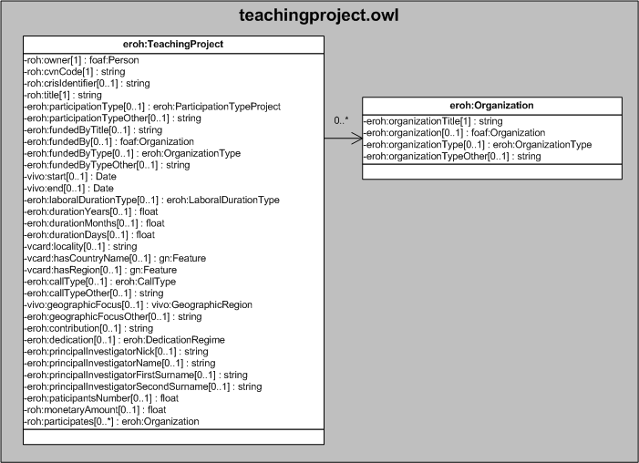

| Fecha         | 15/03/2022                                                   |
| ------------- | ------------------------------------------------------------ |
|Título|Objeto de Conocimiento TeachingProject| 
|Descripción|Descripción del objeto de conocimiento TeachingProject para Hércules|
|Versión|1.0|
|Módulo|Documentación|
|Tipo|Especificación|
|Cambios de la Versión|Versión inicial|

# Hércules ED. Objeto de conocimiento TeachingProject

La entidad eroh:TeachingProject (ver Figura 1) representa una Participación en proyectos de innovación docente en el Curriculum Vitae en la plataforma Hércules.

A continuación se listan todas aquellas propiedades contenidas en eroh:TeachingProject que extienden la ontología fundamental ROH con el fin de ajustarse a las necesidades de Hércules EDMA:

- eroh:owner
- eroh:cvnCode
- roh:crisIdentifier
- roh:title
- eroh:participationType
- eroh:participationTypeOther
- eroh:fundedByTitle
- eroh:fundedBy
- eroh:fundedByType
- eroh:fundedByTypeOther
- vivo:start
- vivo:end
- eroh:laboralDurationType
- eroh:durationYears
- eroh:durationMonths
- eroh:durationDays
- vcard:locality
- vcard:hasCountryName
- vcard:hasRegion
- eroh:callType
- eroh:callTypeOther
- vivo:geographicFocus
- vivo:geographicFocusOther
- eroh:contribution
- eroh:dedication
- eroh:principalInvestigatorNick
- eroh:principalInvestigatorName
- eroh:principalInvestigatorFirstSurname
- eroh:principalInvestigatorSecondSurname
- eroh:participantsNumber
- roh:monetaryAmount
- roh:participates

*Figura 1. Diagrama ontológico para la entidad eroh:TeachingProject*
