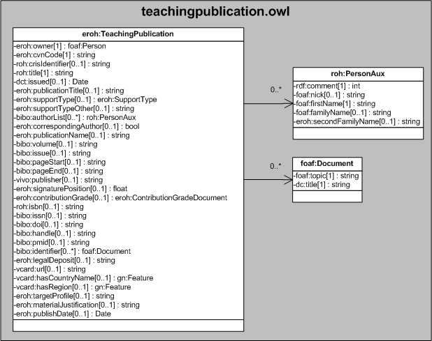

| Fecha         | 15/03/2022                                                   |
| ------------- | ------------------------------------------------------------ |
|Título|Objeto de Conocimiento TeachingPublication| 
|Descripción|Descripción del objeto de conocimiento TeachingPublication para Hércules|
|Versión|1.0|
|Módulo|Documentación|
|Tipo|Especificación|
|Cambios de la Versión|Versión inicial|

# Hércules ED. Objeto de conocimiento TeachingPublication

La entidad eroh:TeachingPublication (ver Figura 1) representa una Publicaciones docente o de carácter pedagógico, libros, artículos, etc. en el Curriculum Vitae en la plataforma Hércules.

Una instancia de eroh:TeachingPublication se asocia con las siguientes entidades a través de propiedades de objeto:

- [foaf:Person](https://github.com/HerculesCRUE/Commons-ED-MA/tree/main/ObjetosDeConocimiento/Person), representa la persona asociada la publicación.
- [eroh:SupportType](https://github.com/HerculesCRUE/Commons-ED-MA/tree/main/ObjetosDeConocimiento/SupportType), representa el tipo de soporte en el que se ha plasmado el material docente.
- roh:PersonAux, representa los autores que han intervenido.
- [eroh:ContributionGradeDocument](https://github.com/HerculesCRUE/Commons-ED-MA/tree/main/ObjetosDeConocimiento/ContributionGradeDocument), representa el tipo de participación.
- foaf:Document, representa otros identificadores del material docente.
- [gn:Feature](https://github.com/HerculesCRUE/Commons-ED-MA/tree/main/ObjetosDeConocimiento/Feature), representa el país y comunidad autónoma de la publicación.

*Figura 1. Diagrama ontológico para la entidad eroh:TeachingPublication*
