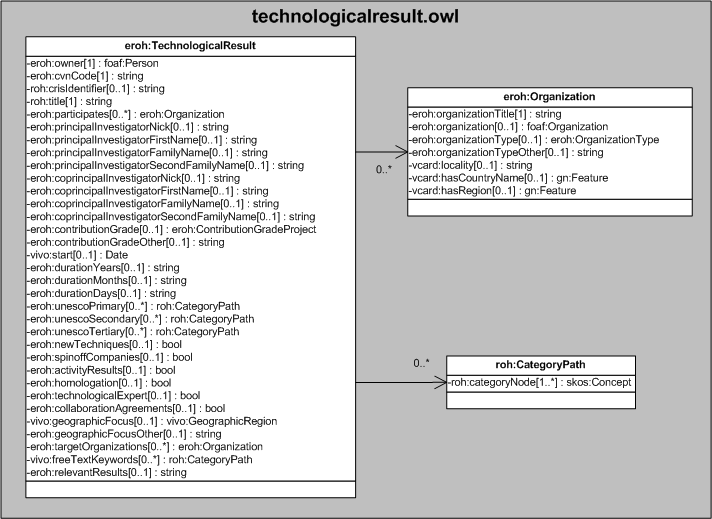

| Fecha         | 10/12/2021                                                   |
| ------------- | ------------------------------------------------------------ |
|Título|Objeto de Conocimiento TechnologicalResult| 
|Descripción|Descripción del objeto de conocimiento TechnologicalResult para Hércules|
|Versión|1.0|
|Módulo|Documentación|
|Tipo|Especificación|
|Cambios de la Versión|Versión inicial|

# Hércules ED. Objeto de conocimiento TechnologicalResult

La entidad eroh:TechnologicalResult (ver Figura 1) representa cualquier resultado tecnológico derivado de actividades especializadas y de transferencia.
Se han añadido varias propiedades que extienden la ontología fundamental con el fin de dar respuesta a las necesidades de gestión de datos requeridas durante el desarrollo de la infraestructura.

Una instancia de eroh:TechnologicalResult se asocia con las siguientes entidades a través de propiedades de objeto:

- [foaf:Person](https://github.com/HerculesCRUE/Commons-ED-MA/tree/main/ObjetosDeConocimiento/Person), representa la persona asociada al resultado tecnológico.
- eroh:Organization, representa las entidades colaboradoras y las entidades destinatarias.
- [eroh:ContributionGradeProject](https://github.com/HerculesCRUE/Commons-ED-MA/tree/main/ObjetosDeConocimiento/ContributionGradeProject), representa el tipo de participación desempeñada.
- roh:CategoryPath, representa los códigos UNESCO y las palabras clave.
- [vivo:GeographicRegion](https://github.com/HerculesCRUE/Commons-ED-MA/tree/main/ObjetosDeConocimiento/GeographicRegion), representa la cobertura geográfica de la actividad.

*Figura 1. Diagrama ontológico para la entidad eroh:TechnologicalResult*
