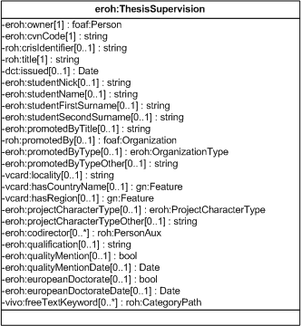

| Fecha         | 15/03/2022                                                   |
| ------------- | ------------------------------------------------------------ |
|Título|Objeto de Conocimiento ThesisSupervision| 
|Descripción|Descripción del objeto de conocimiento ThesisSupervision para Hércules|
|Versión|1.0|
|Módulo|Documentación|
|Tipo|Especificación|
|Cambios de la Versión|Versión inicial|

# Hércules ED. Objeto de conocimiento ThesisSupervision

La entidad eroh:ThesisSupervision (ver Figura 1) representa una dirección de tesis doctoral y/o proyecto fin de carrera en el Curriculum Vitae en la plataforma Hércules.

A continuación se listan todas aquellas propiedades contenidas en eroh:ThesisSupervision que extienden la ontología fundamental ROH con el fin de ajustarse a las necesidades de Hércules EDMA:

- eroh:owner
- eroh:cvnCode
- roh:crisIdentifier
- roh:title
- dct:issued
- eroh:studentNick
- eroh:studentName
- eroh:studentFirstSurname
- eroh:studentSecondSurname
- eroh:promotedByTitle
- roh:promotedBy
- eroh:promotedByType
- eroh:promotedByTypeOther
- vcard:locality
- vcard:hasCountryName
- vcard:hasRegion
- eroh:projectCharacterType
- eroh:projectCharacterTypeOther
- eroh:codirector
- eroh:qualification
- eroh:qualityMention
- eroh:qualityMentionDate
- eroh:europeanDoctorate
- eroh:europeanDoctorateDate
- vivo:freeTextKeyword

*Figura 1. Diagrama ontológico para la entidad eroh:ThesisSupervision*
