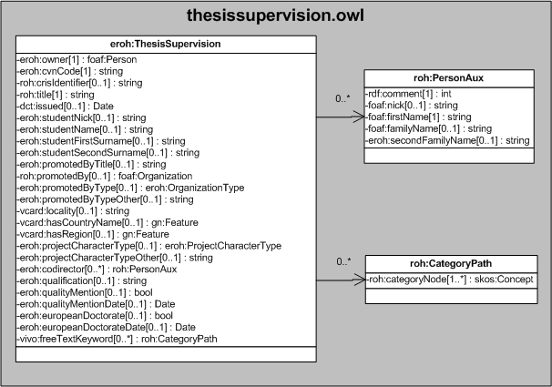

| Fecha         | 15/03/2022                                                   |
| ------------- | ------------------------------------------------------------ |
|Título|Objeto de Conocimiento ThesisSupervision| 
|Descripción|Descripción del objeto de conocimiento ThesisSupervision para Hércules|
|Versión|1.0|
|Módulo|Documentación|
|Tipo|Especificación|
|Cambios de la Versión|Versión inicial|

# Hércules ED. Objeto de conocimiento ThesisSupervision

La entidad eroh:ThesisSupervision (ver Figura 1) representa una dirección de tesis doctoral y/o proyecto fin de carrera en el Curriculum Vitae en la plataforma Hércules.

Una instancia de eroh:ThesisSupervision se asocia con las siguientes entidades a través de propiedades de objeto:

- [foaf:Person](https://github.com/HerculesCRUE/Commons-ED-MA/tree/main/ObjetosDeConocimiento/Person), representa la persona asociada a la tesis doctoral.
- [foaf:Organization](https://github.com/HerculesCRUE/Commons-ED-MA/tree/main/ObjetosDeConocimiento/Organization), representa la entidad de realización de la tesis.
- [eroh:OrganizationType](https://github.com/HerculesCRUE/Commons-ED-MA/tree/main/ObjetosDeConocimiento/OrganizationType), representa el tipo de entidad de realización de la tesis.
- [gn:Feature](https://github.com/HerculesCRUE/Commons-ED-MA/tree/main/ObjetosDeConocimiento/Feature), representa el país y la comunidad autónoma o región de realización.
- [eroh:ProjectCharacterType](https://github.com/HerculesCRUE/Commons-ED-MA/tree/main/ObjetosDeConocimiento/ProjectCharacterType), representa el tipo de proyecto.
- roh:PersonAux, representa los codirectores de la tesis.
- roh:CategoryPath, representa las palabras clave.

*Figura 1. Diagrama ontológico para la entidad eroh:ThesisSupervision*
