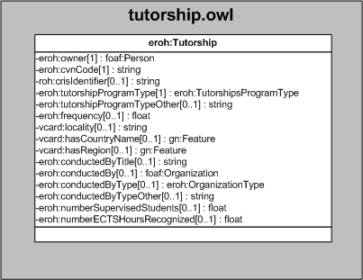

| Fecha         | 15/03/2022                                                   |
| ------------- | ------------------------------------------------------------ |
|Título|Objeto de Conocimiento Tutorship| 
|Descripción|Descripción del objeto de conocimiento Tutorship para Hércules|
|Versión|1.0|
|Módulo|Documentación|
|Tipo|Especificación|
|Cambios de la Versión|Versión inicial|

# Hércules ED. Objeto de conocimiento Tutorship

La entidad eroh:Tutorship (ver Figura 1) representa una tutoria academica en el Curriculum Vitae en la plataforma Hércules.

A continuación se listan todas aquellas propiedades contenidas en eroh:Tutorship que extienden la ontología fundamental ROH con el fin de ajustarse a las necesidades de Hércules EDMA:

 - eroh:owner
 - eroh:cvnCode
 - roh:crisIdentifier
 - eroh:tutorshipProgramType
 - eroh:tutorshipProgramTypeOther
 - eroh:frequency
 - vcard:locality
 - vcard:hasCountryName
 - vcard:hasRegion
 - eroh:conductedByTitle
 - eroh:conductedBy
 - eroh:conductedByType
 - eroh:conductedByTypeOther
 - eroh:numberSupervisedStudents
 - eroh:numberECTSHoursRecognized

*Figura 1. Diagrama ontológico para la entidad eroh:Tutorship*

